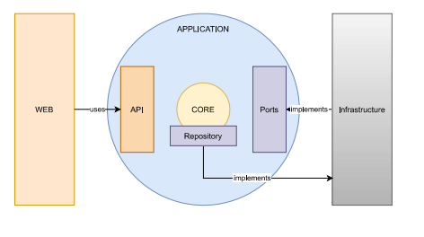

# Commit Viewer

Simple Git public repositories commit viewer.

## Installation

### Prerequisites 
-   JDK11 (https://docs.oracle.com/en/java/javase/11/install/installation-jdk-linux-platforms.html#GUID-737A84E4-2EFF-4D38-8E60-3E29D1B884B8) - LINUX
-   JDK11 (https://docs.oracle.com/en/java/javase/11/install/installation-jdk-microsoft-windows-platforms.html#GUID-A7E27B90-A28D-4237-9383-A58B416071CA) - WINDOWS
-   Git (https://www.linode.com/docs/guides/how-to-install-git-on-linux-mac-and-windows/)
-   Maven (https://maven.apache.org/install.html)

### Database setup (MySQL)

-   Install Database - https://dev.mysql.com/doc/mysql-installation-excerpt/8.0/en/windows-install-archive.html - WINDOWS
-   Install Database - https://docs.rackspace.com/support/how-to/install-mysql-server-on-the-ubuntu-operating-system/ - LINUX
-   Create Schema - CREATE SCHEMA {schema_name};
-   Create user - CREATE USER '{username}@'localhost' IDENTIFIED BY '{password}';
-   Grant privileges - GRANT ALL PRIVILEGES ON {schema_name} TO '{username}@'localhost';

Two schemas should be setup, one for application usage, the other for integration tests.

### Application Server setup (Apache Tomcat)

-   Download Apache Tomcat - https://tomcat.apache.org/download-80.cgi

#### Linux
-   Extract files;
-   chmod +x startup.sh (allows the execution of the startup.sh script)
-   chmod +x catalina.sh (allows the execution of the startup.sh script)
-   chmod +x shutdown.sh (allows the execution of the startup.sh script)
-   start server - ./startup.sh
-   stop server - ./shutdown.sh

#### Windows
-   Extract files;
-   chmod +x startup.sh (UNIX only - allows for the exceution of the startup.sh script)
-   chmod +x catalina.sh (UNIX only - allows for the exceution of the startup.sh script)
-   chmod +x shutdown.sh (UNIX only - allows for the exceution of the startup.sh script)
-   start server - ./startup.sh
-   stop server - ./shutdown.sh
 
#### Configuration File

#####/src/main/resources

spring.datasource.url=jdbc:mysql://localhost:3306/{schema}
spring.datasource.username={db_username}
spring.datasource.password={password}

spring.datasource.driver-class-name=com.mysql.jdbc.Driver

spring.jpa.hibernate.ddl-auto={create/update}
First time application is run this property should be set to 'create', automatic generation of tables.
If data in Database is to be kept after launch, property should be set to 'update'

spring.jpa.database-platform=org.hibernate.dialect.MySQL5Dialect

#####/src/test/resources

spring.datasource.url=jdbc:mysql://localhost:3306/{test_schema}
spring.datasource.username={db_username}
spring.datasource.password={password}

spring.datasource.driver-class-name=com.mysql.jdbc.Driver

spring.jpa.hibernate.ddl-auto=create

spring.jpa.database-platform=org.hibernate.dialect.MySQL5Dialect

It is advised to use a different schema for the integration tests, all data will be purged before each run;
Test data stored in Integration tests will be purged after each test.

### Build
-   Run - mvn clean install (on project home folder)

### Test Coverage
-   Open /{project_folder}/target/site/jacoco/index.html

## Usage

### Endpoint
#### http://{app_url}/api/commits?url={git_repository_url}&?page={page}&size={size}
Provides commits of a given git repository url (mandatory), pagination is optional.
Pagination has a default value of page = 1, size = 5, if no values are provided.

(note: tomcat app url should be 'http://localhost:8080/commit-viewer-0.0.1-SNAPSHOT')
(note: spring boot (Eclipse/IntelliJ) url should be 'http://localhost:8080')

#### Flow
-   User request, through the Web api;
-   Returns commit representation from the the Database for given Git repository Url, if present;
-   No Git Repository is present in Database, Rest GitHub api is called, commits retrieved are stored in DB, and a representation is returned;
-   No Git Repository is present in Database, Rest GitHub api is not able to respond for any reason, commits are retrieved from the Command Line Interface and stored in the DB, a representation is returned.

## Architecture

Application is divided in three main parts, Web, Application, Core, Infrastructure.

### Web 
Rest API, opens the application to outside interaction.
Controllers and Web Configuration classes are all present in this layer.
Error Handling for a better user friendly experience.

### Application
Handles process flows, creates or updates Domain entities (Core).
Provides API for Web layer usage, and contracts (ports) that the Infrastructure layers must obey.

### Core
Domain objects, core business logic should be handled here, how an object can be built, witch fields are mandatory, etc.
Provides contract for persistence layer interaction (Repository).

### Infrastructure
Provides the Application/Core layers with the implementations (adapters/repositories) required to function;

## License

(TODO) License 
